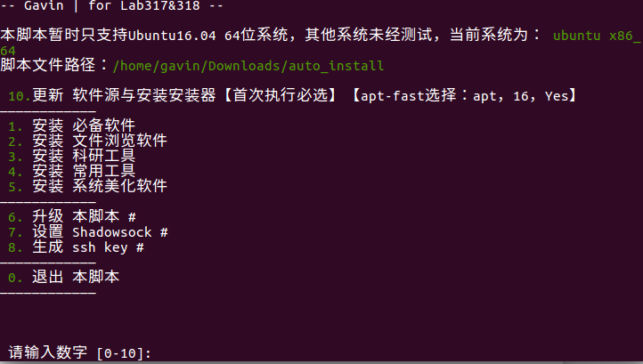

# 一键安装脚本

[TOC]

## 简介

本脚本可实现使用shell在Ubuntu16.04系统一键快速安装常用软件.



## 使用说明

在安装脚本目录输入:

```bash
sudo ./Install.sh
```

输入管理员密码后启动脚本,目前带"#"的项目未添加

首次安装需选择**[10]** ,更新软件源并与安装安装器,apt-fast安装过程中的设置依次选择：apt，16，Yes

软件源测速结果如图:


可根据实际情况修改setting_file文件夹中source_list.txt选择需要添加的软件源

为了更好的观看本文档,可安装脚本中[2]->[4]的Typora软件打开本文档.

除Shadowsocks-qt5及部分美化插件外,其他软件在开始菜单处打开

## 软件清单

### 必备软件

1. 搜狗输入法
2. Google输入法
3. lantern
4. Shadowsocks-qt5
5. NVIDIA驱动

### 文件浏览软件

1. Chromium浏览器
2. 网易云音乐
3. VIM+自动配置
4. Typora
5. 福昕阅读器
6. Calibre
7. WPS Office 

### 科研工具

1. QT 5.10.0
2. VS code
3. ROS kinetic
4. Roboware Studio
5. Anaconda
6. Pycharm
7. Mendeley
8. virtualbox虚拟机

### 常用工具

1. 有道词典【翻译软件】
2. Git【版本管理】
3. Teamviewer【远程控制】
4. nomachine【远程控制】
5. flameshot【截图软件】
6. Seafile客户端【备份软件】
7. Uget+aria2c【下载器】
8. wewechat【微信客户端】
9. gdebi【deb安装器】

### 系统美化软件

1. conky【边栏信息】
2. Docky【底栏】
3. Unity Tweak Tool【系统主题设置】
4. indicator-multiload 【状态栏显示系统信息】
5. cairo-dock【底栏】【推荐】
6. flatabulous-theme+MacUbuntu【主题】
7. gnome-tweak-tool【系统主题设置】

## 安装部分软件设置

**搜狗输入法**:安装完后需重启,在系统设置中选择启用.

**Shadowsocks-qt5**:安装后软件将在后台运行并设置开机启动,如需查看软件界面需找到安装包目录双击打开软件或重启电脑查看.如在setting_file中存在ss_config.ini则自动添加代理服务器信息,如不存在则需在软件界面自行添加,具体查看之前共享的压缩包资料.部分软件可能使用http协议传输无法代理,可参考:ProxyChains,polipo,Privoxy等使这类软件使用国外服务器,脚本暂不添加这部分内容.

**NVIDIA驱动**:TODO

**VIM**:安装过程中已配置代码补全,代码高亮等功能,如需修改,则setting_file中存在vim_setting.txt修改.

**ROS kinetic**:本选项调用()的脚本,安装并在HOME目录创建了一个catkin_ws.

## 补充

欢迎提交常用软件或遇到的bug,联系方式:Xue.JW@qq.com

